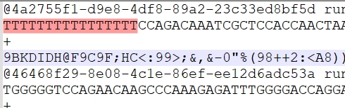
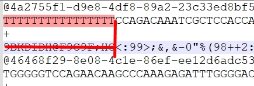

# **Polys Trimmer**
___
## Description

This tool removes poly A and poly T tails from 3' and 5' and nucleotide sequences.
The input data can be in FASTQ format.
Also removes mistakes C/G insertion in the poly A and poly T tail and creat a stats file.
___
## Using

When you open the script(PolysTrimmer.py), you will have the choice of _custom_ parameters or _default_ parameters available to you.

___Default parameters___: prefix = "file", the statistics file directory is the directory of results files, the name of the statistics file is stats_file.

___
## Example of work this script:
- before:

- after:

_Poly T_ and corresponding _accuracy of reading symbols_ were deleted:

___
__Data in the stats file:__
- Total: 3122 // deleted
- Poly A: 1130 // deleted Poly A 
- Poly T: 1355 // deleted Poly T
- Poly A with errors: 318 // Poly A mistkes
- Poly T with errors: 319 // Poly T mistkes
- Poly A errors(%): 21.96
- Poly T errors(%): 19.06
- Middle read length: 233.18175
- Total read(lines): 4000
___

